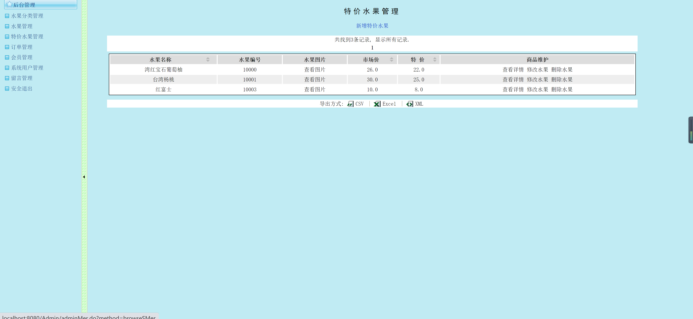

<h1 align="center">水果4S店营销管理系统</h1>

## 简介
水果4S店营销管理系统：角色分为管理员、用户；功能包括水果分类管理、特价水果管理、订单及会员管理，支持登录注册、购物车操作及多格式数据导出。    --计算机毕业设计源码；毕设源码；java毕业设计源码

## 联系方式

<h3 align="center">获取完整代码与数据库文件 + 微信：bysj5151 QQ: 86050149 QQ群: 783742310</h3>

<h3 align="center">可帮忙远程部署 包运行成功！提供远程部署、修改代码、设计文档指导、代码讲解等服务！</h3>

## 功能介绍（完整见运行截图）
管理员：登录系统后可管理水果分类、商品、特价信息、订单和会员，支持查看、修改与删除特价水果，导出数据进行分析，管理系统用户和留言，确保安全退出。  
用户：通过注册和登录访问系统，首页导航包含购物车和订单查看等功能，用户可查看水果详情，添加至购物车并提交订单，管理个人信息和留言。

## 运行截图

本代码来源于网络,仅供学习参考使用!

